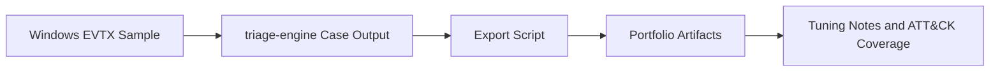
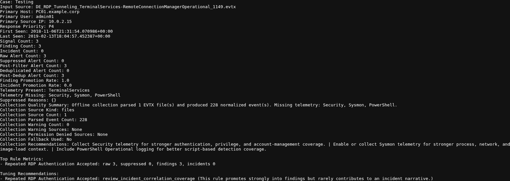
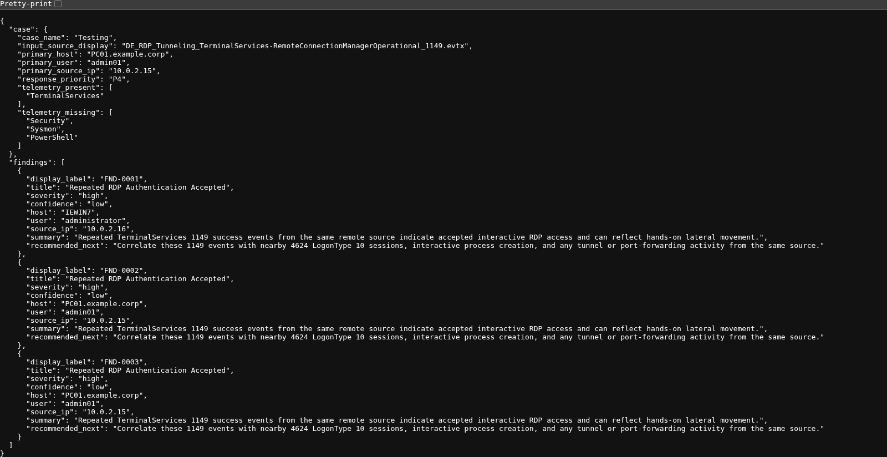
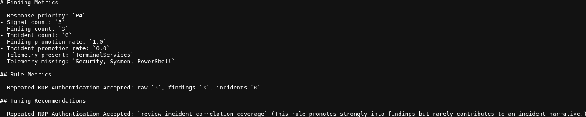

# Project: Detection Engineering and Tuning Lab

## Executive Summary

This project documents a detection engineering workflow built around a Windows RDP authentication use case. Instead of only reviewing alerts, the lab validates detection logic, exports structured case artifacts, reviews telemetry gaps, and explains when a rule should stay visible versus when it should be tuned. The case uses repeated Terminal Services `1149` authentication events that indicate accepted RDP access and maps to ATT&CK `T1021.001`.

## Environment

- Host: VMware
- Analyst VM: Kali Linux
- Source data: Windows TerminalServices EVTX-derived case output
- Detection source: local `triage-engine` case artifacts
- ATT&CK focus: `T1021.001` Remote Desktop Protocol
- Tools: `jq`, Bash, Markdown, EVTX case outputs

## Case Snapshot

- Case name: `Testing`
- Input source: `DE_RDP_Tunneling_TerminalServices-RemoteConnectionManagerOperational_1149.evtx`
- Primary host: `PC01.example.corp`
- Primary user: `admin01`
- Primary source IP: `10.0.2.15`
- Response priority: `P4`
- Signal count: `3`
- Finding count: `3`
- Telemetry present: `TerminalServices`
- Telemetry missing: `Security`, `Sysmon`, `PowerShell`

## Workflow

## Detection Use Case

The use case is intentionally narrow:

1. Look for Windows Terminal Services event `1149`
2. Group repeated successful RDP authentications by host, user, and source IP
3. Promote clusters of repeated authentications into findings
4. Review whether the rule should stay standalone, correlate with more telemetry, or be suppressed in known-good admin paths

The rule is narrow enough to explain clearly while still supporting useful tuning decisions.

## Evidence

Each screenshot below is a direct capture of an exported case artifact.

The case summary preserved the source case, promotion counts, and missing telemetry:

The detection snapshot preserved the promoted findings built from repeated `1149` events:

Finding metrics preserved the three findings, zero incidents, and the correlation-coverage recommendation used in the tuning decision:

Key supporting files:

- [artifacts/case-summary.txt](./artifacts/case-summary.txt)
- [artifacts/finding-metrics.md](./artifacts/finding-metrics.md)
- [artifacts/timeline.csv](./artifacts/timeline.csv)
- [artifacts/detection-snapshot.json](./artifacts/detection-snapshot.json)
- [artifacts/incident-brief.md](./artifacts/incident-brief.md)
- [artifacts/local-tuning-example.json](./artifacts/local-tuning-example.json)

## Supporting Files

- [notes/detection-logic.md](./notes/detection-logic.md)
- [mitre/coverage.md](./mitre/coverage.md)
- [scripts/export_case_artifacts.sh](./scripts/export_case_artifacts.sh)

`./scripts/export_case_artifacts.sh` defaults to `../../triage-engine/cases/Testing`. Pass a case directory as the first argument if your local exported case lives elsewhere.

## Findings Summary

| ID | Finding | Severity | Evidence | Response |
|---|---|---|---|---|
| D-01 | Repeated TerminalServices `1149` success events from the same source were clustered into actionable RDP findings | High | `case-summary.txt`, `detection-snapshot.json`, `timeline.csv` | Keep the rule visible because accepted RDP access is meaningful even before full incident correlation |
| D-02 | Missing `Security`, `Sysmon`, and `PowerShell` telemetry reduced confidence and limited follow-on pivots | Medium | `case-summary.txt`, `finding-metrics.md`, `incident-brief.md` | Expand collection so the rule can correlate with `4624`, process creation, and script activity |
| D-03 | The rule produced three findings and zero incidents in this case, showing a correlation coverage gap rather than a detection failure | Medium | `finding-metrics.md`, `incident-brief.md` | Keep current visibility and build adjacent correlations instead of suppressing the rule too early |

## Detection Logic Summary

The repeated-RDP rule is useful because it is simple and defensible:

- event source: TerminalServices RemoteConnectionManager
- event ID: `1149`
- grouping: same host, user, and source IP
- cluster window: two hours
- threshold: at least two accepted authentications
- ATT&CK mapping: `T1021.001`

That logic stays easy to defend while still opening up meaningful tuning conversations.

## Tuning Decision

For this lab, I would keep `Repeated RDP Authentication Accepted` promoted as a standalone finding instead of downgrading it immediately.

Reasoning:

- accepted interactive RDP access is high-signal enough to deserve analyst visibility
- the current weakness is missing corroborating telemetry, not obvious false positives
- suppressing the rule before documenting jump hosts, admin workstations, or approved maintenance paths would hide useful activity too early

The next improvement is not suppression. It is correlation.

An example overlay is saved at [artifacts/local-tuning-example.json](./artifacts/local-tuning-example.json). It shows what a suppression could look like after an admin jump host is documented and approved. It was not applied to the exported case artifacts in this project.

## Future Improvements

- Add Security `4624` LogonType `10` telemetry to validate session creation.
- Add Sysmon process and network visibility around the same source IP and host.
- Correlate repeated `1149` findings with adjacent lateral-movement signals before adding any suppression.

## Conclusion

This case shows a practical middle ground between alert triage and detection engineering: validate the rule, preserve the evidence, explain confidence gaps, and document the tuning decision clearly.
