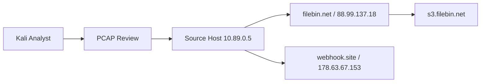
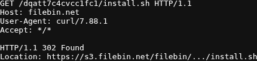
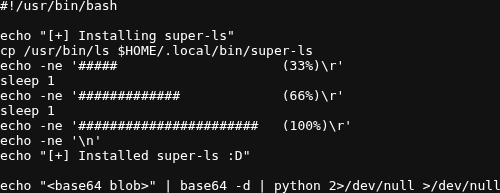
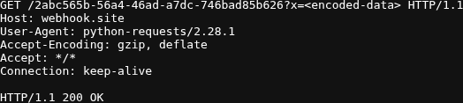

# Project: SOC Homelab Investigation

## Executive Summary

This project presents a SOC network investigation using packet capture evidence from a Linux host. The analysis identified a curl download of install.sh from filebin.net, retrieval of a payload from s3.filebin.net, and subsequent outbound communication to webhook.site using python-requests. The write-up includes triage notes, indicators of compromise, ATT&CK mapping, and a final assessment.

## Environment

- Host: VMware
- Analyst VM: Kali Linux
- Evidence source: packet capture from a Linux system
- Network: lab review of captured traffic
- Tools: Wireshark, `tshark`, `tcpdump`, Nmap, ATT&CK Navigator

## Case Snapshot

- Internal source IP: `10.89.0.5`
- External IPs: `88.99.137.18`, `178.63.67.153`
- Domains: `filebin.net`, `s3.filebin.net`, `webhook.site`
- Capture window: February 3, 2025 14:26:57 to 14:27:00
- Artifact: [artifacts/2025-02-03_suspicious-http-download.pcap](./artifacts/2025-02-03_suspicious-http-download.pcap)

## Topology

## Investigation Workflow

1. Host `10.89.0.5` requests `/dqatt7c4cvcc1fc1/install.sh` from `filebin.net` with `curl/7.88.1`
2. The server issues an HTTP `302` redirect to `s3.filebin.net`
3. The host downloads `install.sh`
4. The script contains a Base64-decoded Python payload
5. The Python code sends encoded environment data to `webhook.site`

The sequence is consistent with suspicious script retrieval followed by outbound data transfer.

## Evidence

Each screenshot below is a direct capture of a saved artifact or focused excerpt, with the full raw packet exports linked below.

The initial request showed `curl` retrieving `install.sh` over HTTP from `filebin.net`:

The recovered script excerpt showed a Base64 blob piped to `python`, which supported the embedded-payload finding:

The outbound request showed `python-requests/2.28.1` reaching `webhook.site` and receiving `200 OK`:

## Findings Summary

| ID | Finding | Severity | Evidence | Response |
|---|---|---|---|---|
| F-01 | Script downloaded over HTTP from `filebin.net` using `curl` | High | `download-request-excerpt.txt`, `http-responses.txt` | Treat source host as potentially compromised and review execution history |
| F-02 | Downloaded script included embedded Python payload | High | `install-script-excerpt.txt`, `decoded_python_payload.py` | Preserve script content and inspect for credential or environment theft |
| F-03 | Outbound request sent encoded data to `webhook.site` | High | `webhook-request-excerpt.txt`, `tcp-stream-webhook.txt` | Block destination and review host for exfiltration or staging activity |

## Saved Artifacts

- [artifacts/download-request-excerpt.txt](./artifacts/download-request-excerpt.txt)
- [artifacts/install-script-excerpt.txt](./artifacts/install-script-excerpt.txt)
- [artifacts/webhook-request-excerpt.txt](./artifacts/webhook-request-excerpt.txt)
- [artifacts/http-requests.txt](./artifacts/http-requests.txt)
- [artifacts/http-responses.txt](./artifacts/http-responses.txt)
- [artifacts/tcp-stream-install.txt](./artifacts/tcp-stream-install.txt)
- [artifacts/tcp-stream-webhook.txt](./artifacts/tcp-stream-webhook.txt)
- [artifacts/decoded_python_payload.py](./artifacts/decoded_python_payload.py)

## Supporting Files

- [notes/incident-report.md](./notes/incident-report.md)
- [notes/iocs.md](./notes/iocs.md)
- [notes/attack-mapping.md](./notes/attack-mapping.md)
- [mitre/coverage.md](./mitre/coverage.md)
- [scripts/analyze_pcap.sh](./scripts/analyze_pcap.sh)

## Analyst Conclusion

The capture shows a clear sequence of script retrieval, payload delivery, and outbound communication. Based on that chain, the host should be treated as potentially compromised until execution history, process activity, and destination reachability are reviewed.
