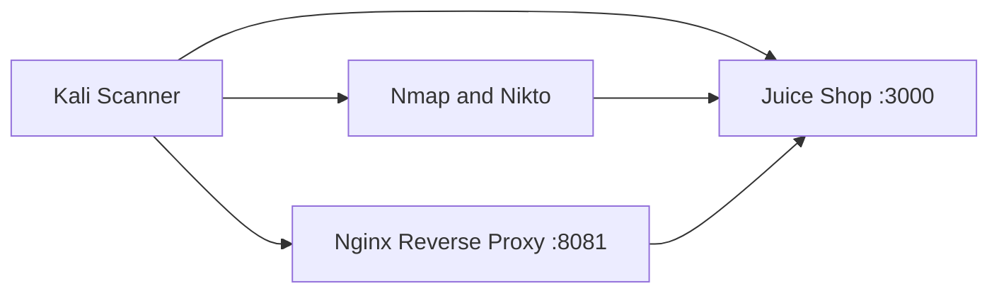
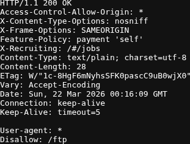
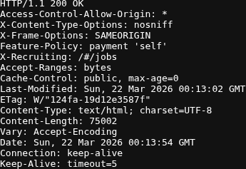
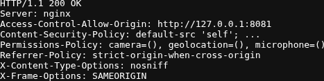
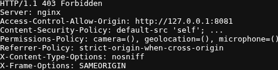

# Project: Vulnerability Management Lab

## Executive Summary

This project documents a focused vulnerability management workflow against OWASP Juice Shop in a local Docker lab. The goal is to identify exposed services and application weaknesses, prioritize validated findings, document remediation options, and verify follow-up actions. The focus is on evidence, prioritization, and clear reporting rather than relying on scanner output alone.

## Environment

- Host: VMware
- Scanner VM: Kali Linux
- Target app: OWASP Juice Shop
- Access path: `http://127.0.0.1:3000`
- Network: local Docker-exposed service
- Tools: Nmap, Nikto, Firefox, terminal, nginx

## Assessment Scope

- One web application target
- One exposed service review
- One short prioritized findings list
- One validation pass after remediation guidance or compensating controls
- One local reverse-proxy hardening comparison

## Case Snapshot

- Target: `http://127.0.0.1:3000`
- Validation path: `http://127.0.0.1:8081`
- Platform: OWASP Juice Shop in Docker
- Discovery tools used: `curl`, `nmap`, `nikto`
- Validation tooling: local `nginx` reverse proxy with saved before-and-after `HTTP` artifacts
- Key takeaway: scanner output required manual validation to separate real findings from single-page app false positives

## Topology

## Assessment Workflow

1. Started a local vulnerable application target
2. Verified connectivity and identified exposed services
3. Ran lightweight assessment tools against the target
4. Reviewed and prioritized findings
5. Built a hardened reverse proxy to test compensating controls without modifying the Juice Shop source
6. Performed a validation pass and updated the findings summary

## Evidence

Each screenshot below is a direct capture of a saved artifact or a focused excerpt so the relevant headers and response codes remain readable in the README.

Baseline `robots.txt` disclosed `/ftp/`, which supported `V-01`:

Baseline response headers showed `Access-Control-Allow-Origin: *` and no `Content-Security-Policy` header in the observed response, which supported `V-02` and `V-03`:

The hardened proxy narrowed the allowed origin and added CSP and supporting browser security headers:

The hardened proxy also returned `403 Forbidden` for `/ftp/`, which closed the route exposure used in `V-01`:

## Saved Artifacts

- [artifacts/http-headers.txt](./artifacts/http-headers.txt)
- [artifacts/nmap-initial.txt](./artifacts/nmap-initial.txt)
- [artifacts/nikto-initial.txt](./artifacts/nikto-initial.txt)
- [artifacts/robots-response.txt](./artifacts/robots-response.txt)
- [artifacts/ftp-head.txt](./artifacts/ftp-head.txt)
- [artifacts/archive-head.txt](./artifacts/archive-head.txt)
- [artifacts/validation-baseline-http-headers.txt](./artifacts/validation-baseline-http-headers.txt)
- [artifacts/validation-baseline-robots.txt](./artifacts/validation-baseline-robots.txt)
- [artifacts/validation-baseline-ftp-head.txt](./artifacts/validation-baseline-ftp-head.txt)
- [artifacts/validation-hardened-http-headers.txt](./artifacts/validation-hardened-http-headers.txt)
- [artifacts/validation-hardened-robots.txt](./artifacts/validation-hardened-robots.txt)
- [artifacts/validation-hardened-ftp-head.txt](./artifacts/validation-hardened-ftp-head.txt)
- [artifacts/validation-summary.md](./artifacts/validation-summary.md)

## Supporting Files

- [mitre/defensive-context.md](./mitre/defensive-context.md)
- [scripts/run_discovery.sh](./scripts/run_discovery.sh)
- [scripts/run_hardening_validation.sh](./scripts/run_hardening_validation.sh)
- [hardening/nginx.conf](./hardening/nginx.conf)

## Findings Summary

| ID | Vulnerability | Severity | Evidence | Remediation |
|---|---|---|---|---|
| V-01 | `robots.txt` discloses `/ftp/` and the route is directly reachable | Medium | `robots-response.txt`, `validation-baseline-ftp-head.txt`, `validation-hardened-robots.txt`, `validation-hardened-ftp-head.txt` | Sanitized `robots.txt` and blocked `/ftp/` at the reverse proxy during validation |
| V-02 | Application responses include `Access-Control-Allow-Origin: *` | Low | `http-headers.txt`, `validation-hardened-http-headers.txt` | Limited allowed origin to the local reverse-proxy host during validation |
| V-03 | Content Security Policy header is not present in the observed response | Low | `http-headers.txt`, `validation-hardened-http-headers.txt` | Added CSP and supporting browser security headers at the reverse proxy during validation |

## Hardening Validation Pass

To show a before and after comparison without patching the Juice Shop source, I placed the application behind a local Nginx reverse proxy on 127.0.0.1:8081.

The proxy applied four compensating controls:

- served a sanitized `robots.txt` that no longer advertises `/ftp/`
- blocked direct access to `/ftp/` with `403 Forbidden`
- rewrote `Access-Control-Allow-Origin` from `*` to the local proxy origin
- added `Content-Security-Policy`, `Permissions-Policy`, and `Referrer-Policy`

This validation demonstrates compensating controls and does not claim that the underlying training application was permanently fixed.

## Validation and Triage

The initial Nikto run generated many backup-file findings such as `/archive.tar` and `/dump.jks`. Manual validation showed these were not distinct exposed backup files. The application returned the same HTML shell for arbitrary paths, which created scanner noise.

This triage step prevented the report from overstating risk.

The follow-up validation pass then used `artifacts/validation-*.txt` to confirm the compensating controls worked as intended:

- baseline `/ftp/` returned `200 OK`, while the hardened proxy returned `403 Forbidden`
- baseline `/robots.txt` disclosed `/ftp/`, while the hardened proxy returned a sanitized file
- baseline responses returned `Access-Control-Allow-Origin: *`, while the hardened proxy narrowed the origin and added CSP

## Assessment Notes

- `V-01` matters because it discloses a sensitive-looking path and confirms the route is reachable; the proxy validation removed the disclosure and blocked direct access
- `V-02` is lower risk here because no credentialed cross-origin workflow was validated, but it still reflects weak default exposure; the validation pass showed a narrower origin policy.
- `V-03` is a hardening gap rather than evidence of direct compromise; the validation pass showed how a proxy can add CSP even when the lab application remains unchanged.

## Next Steps

If this were a production application instead of a training target, I would:

1. Replace the proxy-only controls with app-native fixes where possible
2. Remove or limit route disclosure in `robots.txt`
3. Restrict CORS to required origins only
4. Keep CSP and review the remaining browser security headers after application changes
5. Retest after the changes and compare headers and route exposure

## Conclusion

The assessment remained intentionally narrow: confirm validated issues, discard scanner noise, and document evidence after hardening. The reverse-proxy comparison provides a clear before-and-after record without changing the underlying training application.
