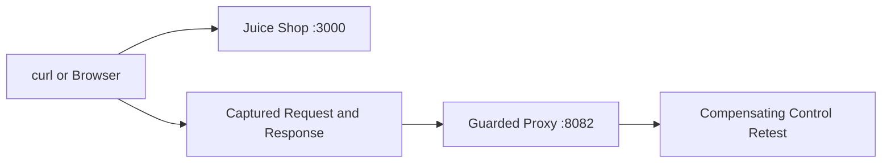
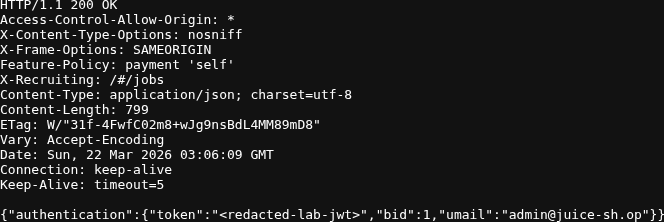
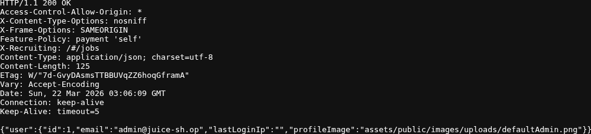
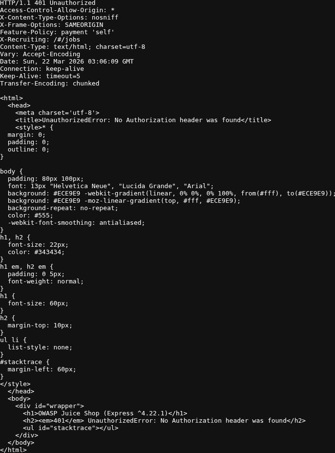
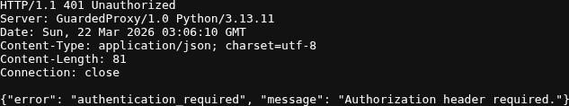

# Project: Web Application Pentest Lab

## Executive Summary

This project assesses a deliberately vulnerable web application, validates two narrowly scoped findings with direct request and response evidence, and shows retesting through a lightweight compensating control. The focus is safe lab validation and clear reporting rather than broad or inflated claims.

## Environment

- Host: VMware
- Analyst VM: Kali Linux
- Target App: OWASP Juice Shop
- Access URL: `http://127.0.0.1:3000`
- Network: Local lab only
- Tools: `curl`, Chromium/Firefox, terminal, lightweight Python proxy, optional Burp Suite Community Edition or OWASP ZAP

## Scope

- `POST /rest/user/login`
- `GET /rest/user/whoami`
- `GET /api/Users`

This is intentionally narrow. I did not claim full application coverage.

## Test Flow



## Validation Workflow

1. Deployed the target application
2. Scoped testing to the login and user-management API endpoints
3. Validated a SQL injection authentication bypass against `/rest/user/login`
4. Confirmed the returned session token mapped to the admin user through `/rest/user/whoami`
5. Validated verbose unauthorized error disclosure on `/api/Users`
6. Added a local guarded proxy and retested both findings through the compensating control

## Reproduction

```bash
./scripts/start_target.sh
./scripts/run_validation.sh
```

## Evidence

Each screenshot below is a direct capture of a saved request or response artifact.

The login bypass response returned `200 OK` with an admin token:


Replaying that session resolved to the admin account:


Unauthenticated access to `/api/Users` returned a verbose error page that disclosed `OWASP Juice Shop (Express ^4.22.1)`:


The compensating-control retest returned a generic JSON `401` for `/api/Users`:


The blocked SQL injection retest is saved separately in [artifacts/retest-sqli-login-blocked.txt](./artifacts/retest-sqli-login-blocked.txt).

## Supporting Files

- [notes/finding-notes.md](./notes/finding-notes.md)
- [scripts/start_target.sh](./scripts/start_target.sh)
- [scripts/check_target.sh](./scripts/check_target.sh)
- [scripts/run_validation.sh](./scripts/run_validation.sh)
- [scripts/start_guarded_proxy.sh](./scripts/start_guarded_proxy.sh)
- [scripts/stop_guarded_proxy.sh](./scripts/stop_guarded_proxy.sh)
- [scripts/guarded_proxy.py](./scripts/guarded_proxy.py)

## Saved Artifacts

- [artifacts/baseline-api-users-verbose.txt](./artifacts/baseline-api-users-verbose.txt)
- [artifacts/baseline-login-invalid.txt](./artifacts/baseline-login-invalid.txt)
- [artifacts/finding-sqli-login-bypass.txt](./artifacts/finding-sqli-login-bypass.txt)
- [artifacts/finding-sqli-whoami.txt](./artifacts/finding-sqli-whoami.txt)
- [artifacts/retest-sqli-login-blocked.txt](./artifacts/retest-sqli-login-blocked.txt)
- [artifacts/retest-api-users-generic-401.txt](./artifacts/retest-api-users-generic-401.txt)
- [artifacts/validation-summary.md](./artifacts/validation-summary.md)

The login-bypass artifact keeps the HTTP response structure but replaces the live JWT with `<redacted-lab-jwt>`.

## Findings Summary

| ID | Finding | Severity | Evidence | Mitigation |
|---|---|---|---|---|
| W-01 | SQL injection in the login API allowed authentication bypass to the admin account | High | `finding-sqli-login-bypass.txt`, `finding-sqli-whoami.txt`, `retest-sqli-login-blocked.txt` | Parameterized queries and input handling in the application; guarded proxy blocked obvious injection markers during retest |
| W-02 | Unauthenticated access to `/api/Users` returned a verbose error page with framework disclosure | Low | `baseline-api-users-verbose.txt`, `retest-api-users-generic-401.txt` | Return generic unauthorized responses and suppress framework/version details |

## Validation Summary

Baseline:

- the SQL injection payload in the `email` field produced a `200 OK` login response with an admin token
- replaying that token as the application cookie resolved to `admin@juice-sh.op`
- unauthenticated access to `/api/Users` exposed a verbose Express error page

Retest:

- the guarded proxy returned `403 Forbidden` for the same SQL injection payload
- the guarded proxy returned a minimal JSON `401` for unauthenticated `/api/Users`

This is a compensating-control retest, not a claim that Juice Shop itself was patched.

## Conclusion

The project stays deliberately narrow: two validated findings, direct proof for each claim, and a compensating-control retest that shows the difference between baseline behavior and a hardened path.
